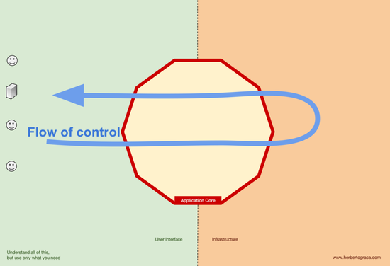
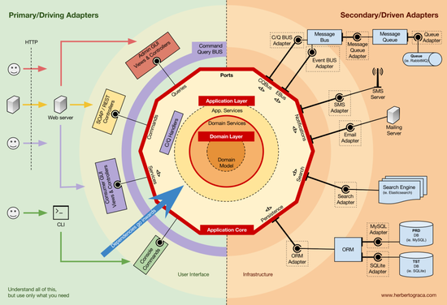

# User Service

## Pre-requirements

Install [Poetry](https://python-poetry.org/docs/#installation)

```sh
pip install --user poetry
poetry install
```

## Run Server

```sh
make start
```

## Run Tests

```sh
make test
```

## Run Format

```sh
make format
```

## Run Linter

```sh
make flake8
```

## Run Code Checker

```sh
make mypy
```

## Build Docker Image

```sh
make docker.build
```

or

```sh
make docker.build-no-cache
```

## DB Migrations

```sh
make db.migrate
```

or

```sh
make db.makemigrations
```

## Folder Structure in the User Service Module

This project uses [clean architecture](https://blog.cleancoder.com/uncle-bob/2012/08/13/the-clean-architecture.html) pattern for folder structure.

### Flow of control



### Architecture overview



### Infrastructure

`infrastructure` is for infrastructure adapters like database, salesforce, observability, etc.

### Domain

`domain` is for domain objects like entities, value objects, repositories etc.

### Application

`application` is for application objects like use cases, converters etc.

### User Interfaces

`interfaces` is for user interfaces like cli, graphql, rest api etc.

## Folder Structure for Tests

- Unit Tests
- E2E Tests
